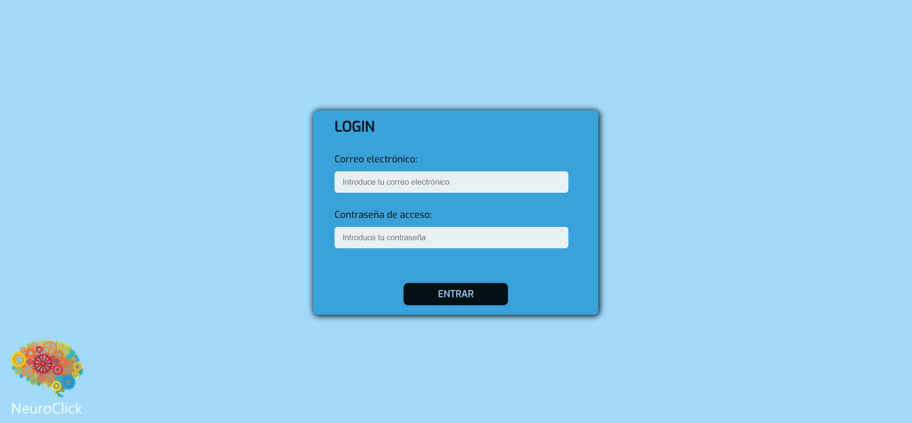

# NEUROCLICK (FRONTEND)

## PARTE FRONTAL QUE CONECTA CON LA API DE LA APLICACIÓN (https://github.com/aramossanchez/neuroclick_backend) 🤜🤛


## APLICACIÓN PARA LA GESTIÓN DE UNA CLÍNICA DE NEUROREHABILITACIÓN 🧠

Aplicación con la que gestionar los diferentes usuarios y profesionales de una clínica de neurorehabiliación.
Entre las diferentes funciones que tiene la aplicación cabe destacar:
* Login en la aplicación.
* Existencia de diferentes roles dentro de la aplicación (admin, Administración, y profesionales encargados de los tratamientos a los usuarios).
* La posibilidad de dejar guardados los resultados de las pruebas estandarizadas realizadas al usuario, por cada tipo de profesional trabajando en la clínica (Fisioterapia, Terapia Ocupacional, Neuropsicología y Logopedia).
* La posibilidad de que cualquier profesional (de los mencionados anteriormente) pueda acceder al histórico de cada una de las pruebas realizadas a cualquier usuario.
* La limitación de crear nuevas pruebas solamente del mismo tipo de profesional logado en la aplicación.
* Solo los profesionales con perfil de Administración podrán editar los datos de los usuarios, así como dar de alta a nuevos usuarios y profesionales, pero no tendrán acceso a las pruebas.
* El usuario con perfil de admin tendrá acceso a todas las tablas de la base de datos. Podrá crear registros nuevos y leer, modificar y borrar los registros ya existentes.

## TECNOLOGÍAS UTILIZADAS 🔨
* react
* redux
* axios
* sass

## REQUISITOS PARA HACERLO FUNCIONAR EN UN EQUIPO LOCAL 💻
* Es necesario tener instalado en el equipo **Nodejs**. Si no lo está, se puede descargar de su página oficial https://nodejs.org/
* Clonar el proyecto en nuestro equipo con git bash:
```
$git clone 'url-del-repositorio'
```
* Instalar todas las dependecias con el siguiente comando:
```
npm install
```
* Arrancamos el servidor con el siguiente comando:
```
npm start
```

## EXPLICACIÓN DE LAS DISTINTAS VISTAS
* **PANTALLA DE LOGIN:** Desde esta pantalla se accede a la aplicación. Es necesario el correo electrónico y la constraseña de un trabajador dado de alta en la base de datos.



* **HISTORIA CLÍNICA:** En esta vista se pueden visualizar los datos personales y sociales del usuario.
* **DATOS MÉDICOS:** En esta vista se pueden visualizar los datos médicos del usuario, así como las enfermedades, los antecedentes familiares y la medicación que toma actualmente.
* **FISIOTERAPIA:** En esta vista se pueden visualizar todas las pruebas de fisioterapia. Se pueden ver las pruebas realizadas de cada tipo de prueba, así como lanzar pruebas para guardar los resultados en la base de datos.
* **TERAPIA OCUPACIONAL:** En esta vista se pueden visualizar todas las pruebas de terapia ocupacional. Se pueden ver las pruebas realizadas de cada tipo de prueba, así como lanzar pruebas para guardar los resultados en la base de datos.
* **NEUROPSICOLOGÍA:** En esta vista se pueden visualizar todas las pruebas de neuropsicología. Se pueden ver las pruebas realizadas de cada tipo de prueba, así como lanzar pruebas para guardar los resultados en la base de datos.
* **LOGOPEDIA:** En esta vista se pueden visualizar todas las pruebas de logopedia. Se pueden ver las pruebas realizadas de cada tipo de prueba, así como lanzar pruebas para guardar los resultados en la base de datos.
* **EVOLUTIVA:** En esta vista se puede visualizar un listado de todos los tipos de pruebas realizadas al usuario. Marcando las pruebas deseadas y pulsando el botón de "MOSTRAR EVOLUTIVA DE PRUEBAS", se muestran las gráficas con las 3 últimas pruebas realizadas de cada tipo de prueba seleccionada.
* **SEGUIMIENTOS:** En esta vista se puede visualizar los seguimientos creados por cada profesional, así como crear seguimientos nuevos.
* **AGENDA:** En esta vista se puede visualizar las citas pendientes y pasadas, tanto todas las del usuario como todas las de cada tipo de profesional que tengan con cualquier usuario.
* **INFORMES:** 

## URL DE DEPLOY 💥
https://master.dhtjmui0e4adn.amplifyapp.com/aplicacion