# NEUROCLICK (FRONTEND)

## PARTE FRONTAL QUE CONECTA CON LA API DE LA APLICACIÓN (https://github.com/aramossanchez/neuroclick_backend) 🤜🤛

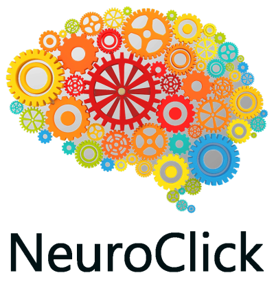

## APLICACIÓN PARA LA GESTIÓN DE UNA CLÍNICA DE NEUROREHABILITACIÓN 🧠

Aplicación con la que gestionar los diferentes usuarios y profesionales de una clínica de neurorehabiliación.
Entre las diferentes funciones que tiene la aplicación cabe destacar:
* Login en la aplicación.
* Existencia de diferentes roles dentro de la aplicación (admin, Administración, y profesionales encargados de los tratamientos a los usuarios).
* La posibilidad de dejar guardados los resultados de las pruebas estandarizadas realizadas al usuario, por cada tipo de profesional trabajando en la clínica (Fisioterapia, Terapia Ocupacional, Neuropsicología y Logopedia).
* La posibilidad de que cualquier profesional (de los mencionados anteriormente) pueda acceder al histórico de cada una de las pruebas realizadas a cualquier usuario.
* La limitación de crear nuevas pruebas solamente del mismo tipo de profesional logado en la aplicación.
* Solo los profesionales con perfil de Administración podrán editar los datos de los usuarios, así como dar de alta a nuevos usuarios y profesionales, pero no tendrán acceso a las pruebas.
* El profesional con perfil de admin tendrá acceso a todas las tablas de la base de datos. Podrá crear registros nuevos y leer, modificar y borrar los registros ya existentes.

## TECNOLOGÍAS UTILIZADAS 🔨
* react
* redux
* axios
* sass

## REQUISITOS PARA HACERLO FUNCIONAR EN UN EQUIPO LOCAL 💻
* Es necesario tener instalado en el equipo **Nodejs**. Si no lo está, se puede descargar de su página oficial https://nodejs.org/
* Clonar el proyecto en nuestro equipo con git bash:
```
$git clone 'url-del-repositorio'
```
* Instalar todas las dependecias con el siguiente comando:
```
npm install
```
* Arrancamos el servidor con el siguiente comando:
```
npm start
```

## EXPLICACIÓN DE LAS DISTINTAS VISTAS 📊

* **PANTALLA DE LOGIN:** Desde esta pantalla se accede a la aplicación. Es necesario el correo electrónico y la contraseña de un trabajador dado de alta en la base de datos.


* **DIFERENTES ROLES:** En función del rol que tenga asignado el profesional podrá ver unas vistas u otras.

* * **admin:** En la vista que ve el profesional con rol de admin se muestran todas las tablas de la base de datos. Además de poder ver todos los registros, se pueden actualizar o borrar estos registros, y crear registros nuevos.

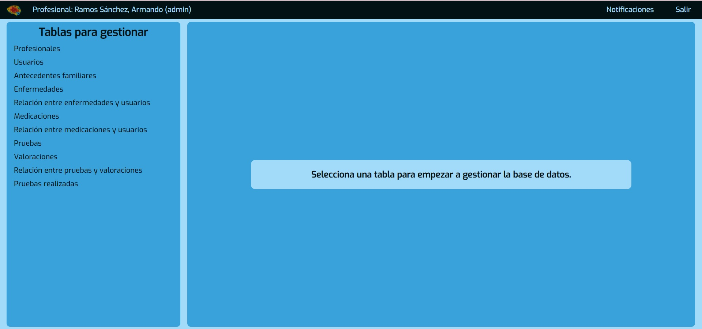

* * **Administración:** En la vista que ve el profesional con rol de Administración se pueden visualizar los datos personales y los datos médicos del usuario, además de la agenda del resto de profesionales (citas con usuarios). Este perfil de profesional, además, puede editar estos datos de los usuarios y de la agenda. Por último, este perfil puede dar de alta tanto a usuarios como a profesionales.

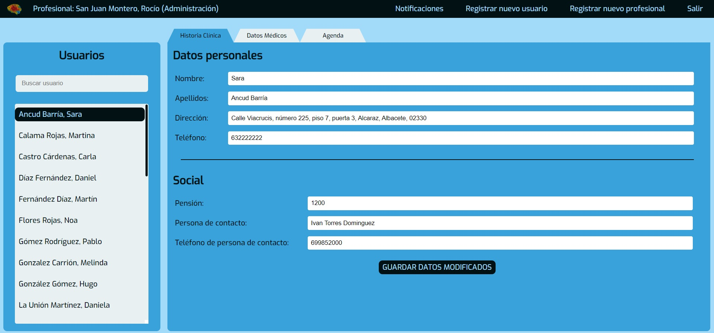

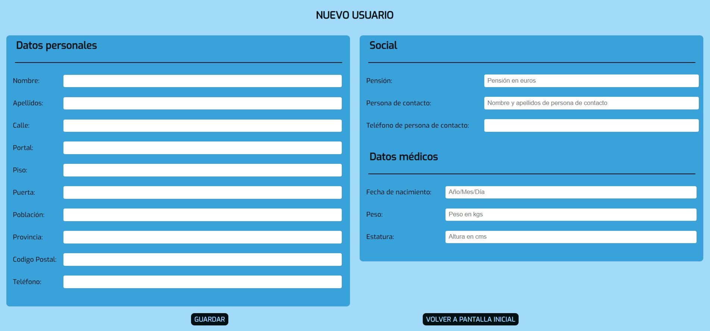

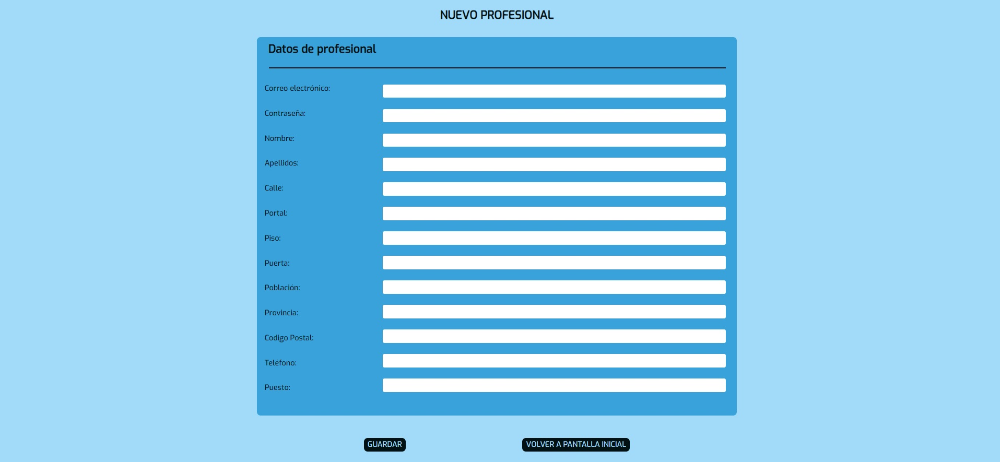

* * **Profesional que trata a los usuarios de la clínica (Fisioterapia, Terapia Ocupacional, Neuropsicología y Logopedia):** En la vista que ven los profesionales con rol que trata a usuarios se pueden visualizar los datos personales y los datos médicos del usuario, las pruebas realizadas por todos los profesionales al usuario, una evolutiva de las pruebas deseadas, revisar y añadir seguimientos por escrito a la ficha del usuario, revisar la agenda de ese usuario con todos los profesionales y redactar informes, con posibilidad de exportarlo en formato .pdf. Este perfil de profesional podrá crear pruebas del tipo de su profesión, y solo de su tipo.

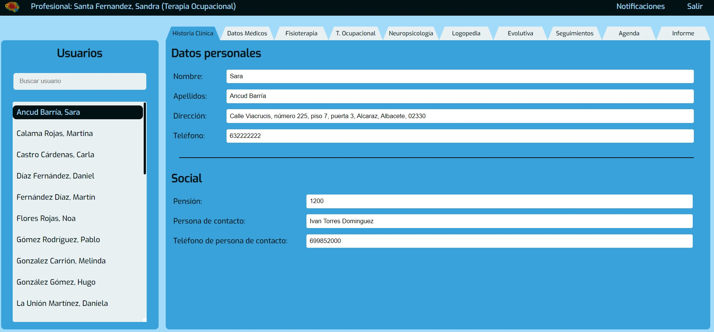

* **DIFERENTES PESTAÑAS EN LA PANTALLA PRINCIPAL:** En la aplicación se realizan las diferentes funciones entrando a cada una de las pestañas disponibles.

* * **Historia clínica:** En esta pestaña se pueden visualizar los datos personales y sociales del usuario.

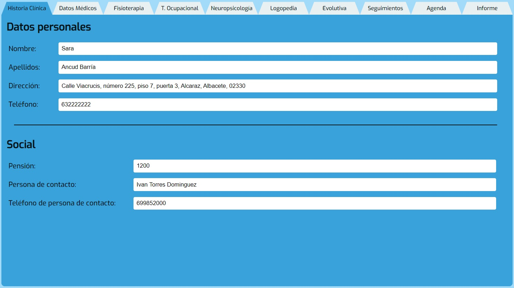

* **Datos médicos:** En esta pestaña se pueden visualizar los datos médicos del usuario, así como las enfermedades, los antecedentes familiares y la medicación que toma actualmente.

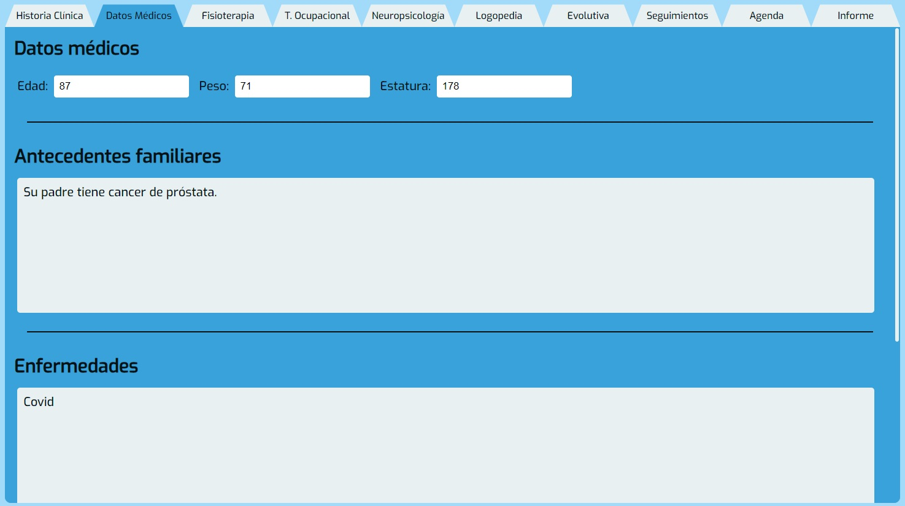

* **Fisioterapia:** En esta pestaña se pueden visualizar todas las pruebas de fisioterapia. Se pueden ver las pruebas realizadas de cada tipo de prueba, así como lanzar pruebas para guardar los resultados en la base de datos.

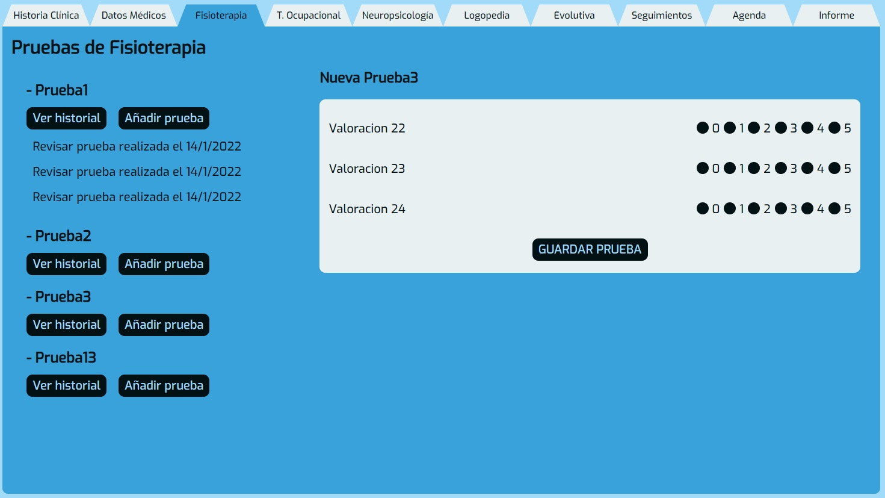

* **Terapia Ocupacional:** En esta pestaña se pueden visualizar todas las pruebas de terapia ocupacional. Se pueden ver las pruebas realizadas de cada tipo de prueba, así como lanzar pruebas para guardar los resultados en la base de datos.

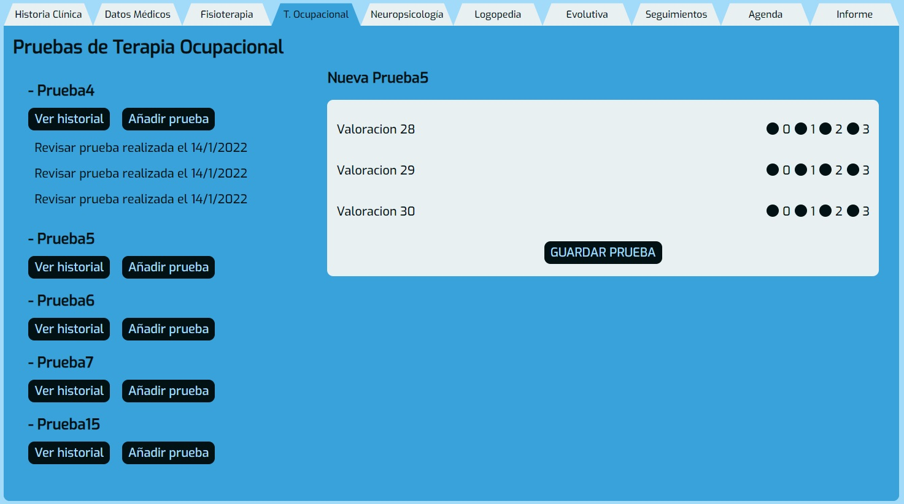

* **Neuropsicología:** En esta pestaña se pueden visualizar todas las pruebas de neuropsicología. Se pueden ver las pruebas realizadas de cada tipo de prueba, así como lanzar pruebas para guardar los resultados en la base de datos.

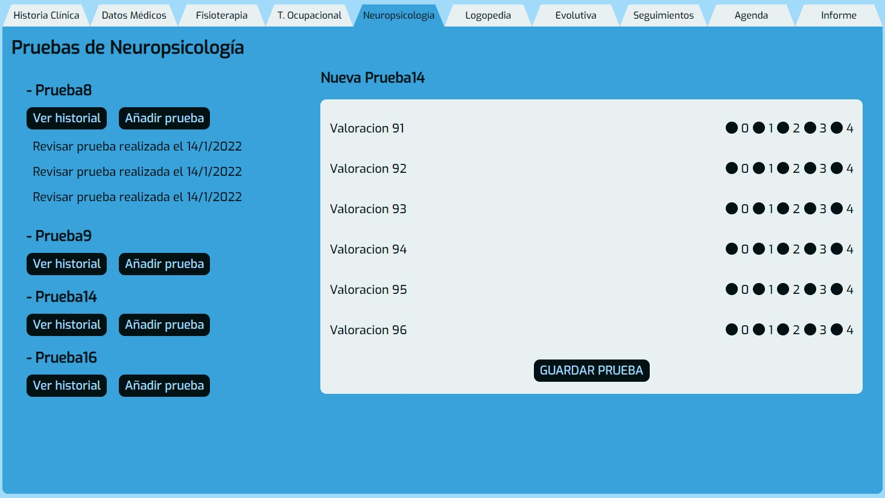

* **Logopedia:** En esta pestaña se pueden visualizar todas las pruebas de logopedia. Se pueden ver las pruebas realizadas de cada tipo de prueba, así como lanzar pruebas para guardar los resultados en la base de datos.

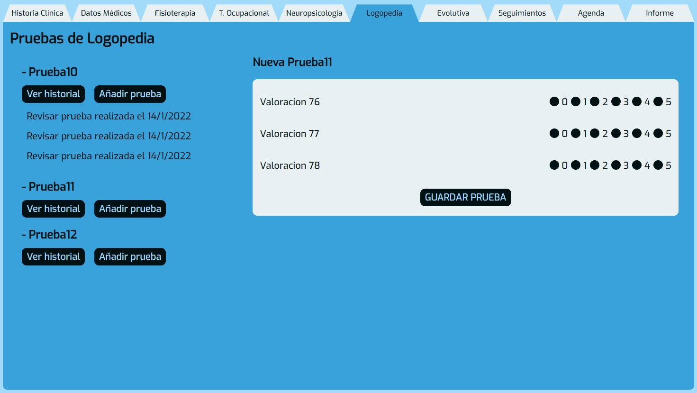

* **Evolutiva:** En esta pestaña se puede visualizar un listado de todos los tipos de pruebas realizadas al usuario. Marcando las pruebas deseadas y pulsando el botón de "MOSTRAR EVOLUTIVA DE PRUEBAS", se muestran las gráficas con las 3 últimas pruebas realizadas de cada tipo de prueba seleccionada.

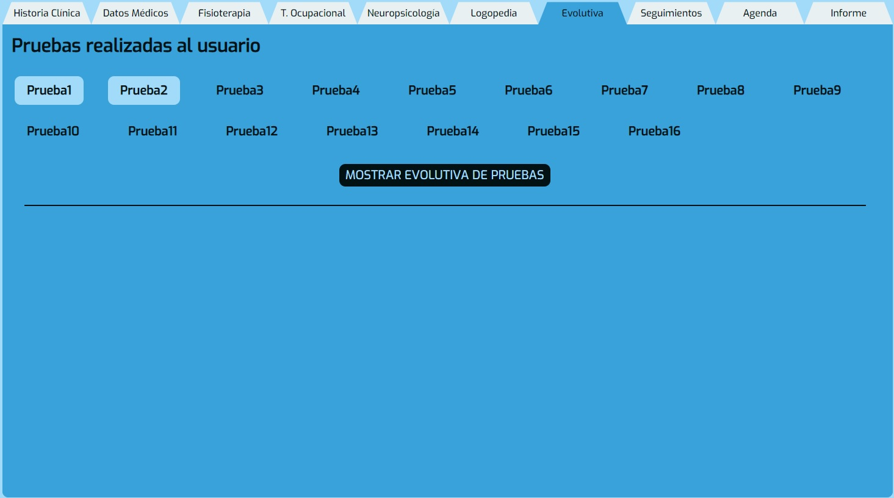

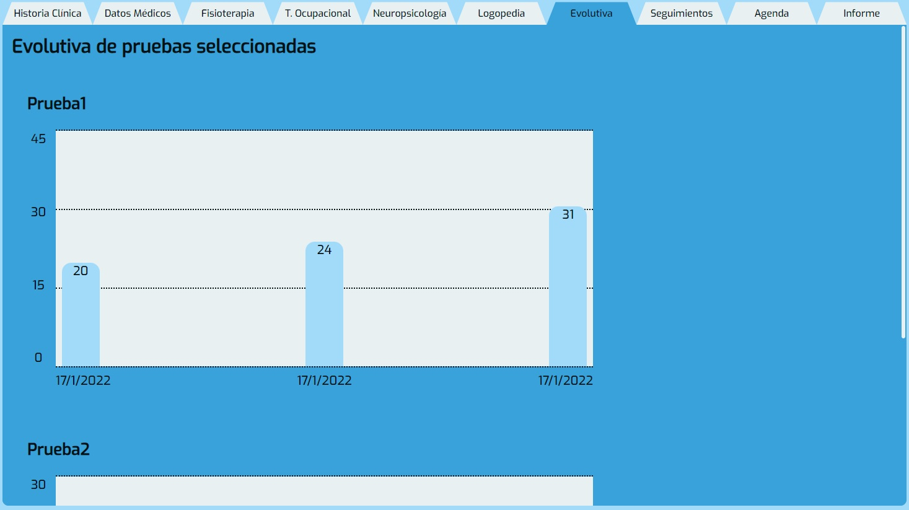

* **(EN DESARROLLO) Seguimientos:** En esta pestaña se puede visualizar los seguimientos creados por cada profesional, así como crear seguimientos nuevos.

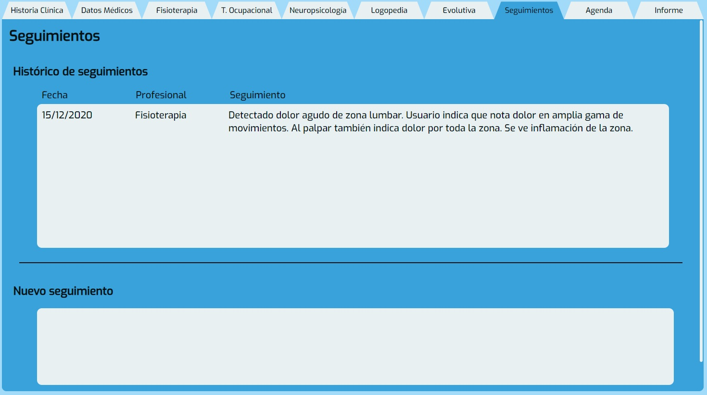

* **(EN DESARROLLO) Agenda:** En esta pestaña se puede visualizar las citas pendientes y pasadas, tanto todas las del usuario como todas las de cada tipo de profesional que tengan con cualquier usuario.


* **(EN DESARROLLO) Informe:** En esta pestaña se pueden crear informes. Se puede añadir motivo de informe, valoración y resultados de las pruebas que se se seleccionen. Al pulsar el botón "GUARDAR INFORME" se genera un archivo .pdf.

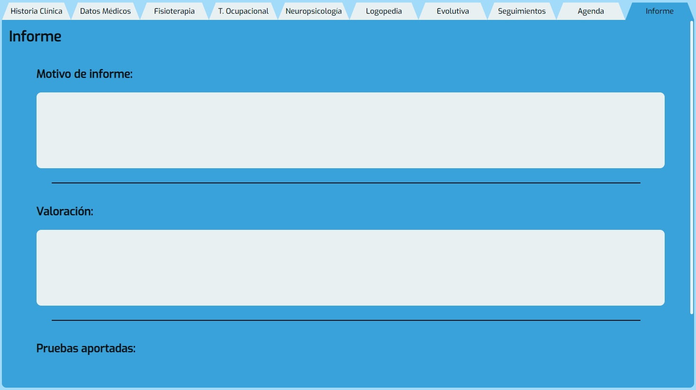

## URL DE DEPLOY 💥
https://deploy.dq3nrnn7x4ccs.amplifyapp.com